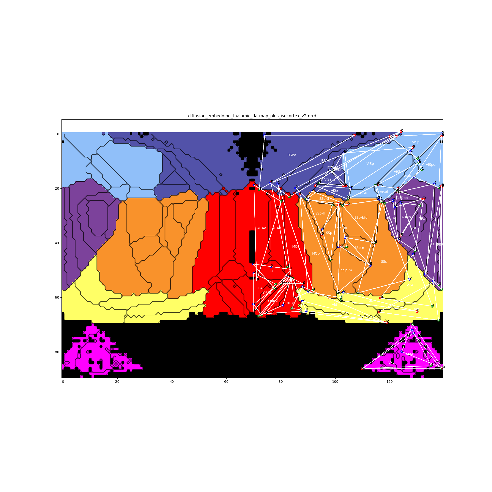
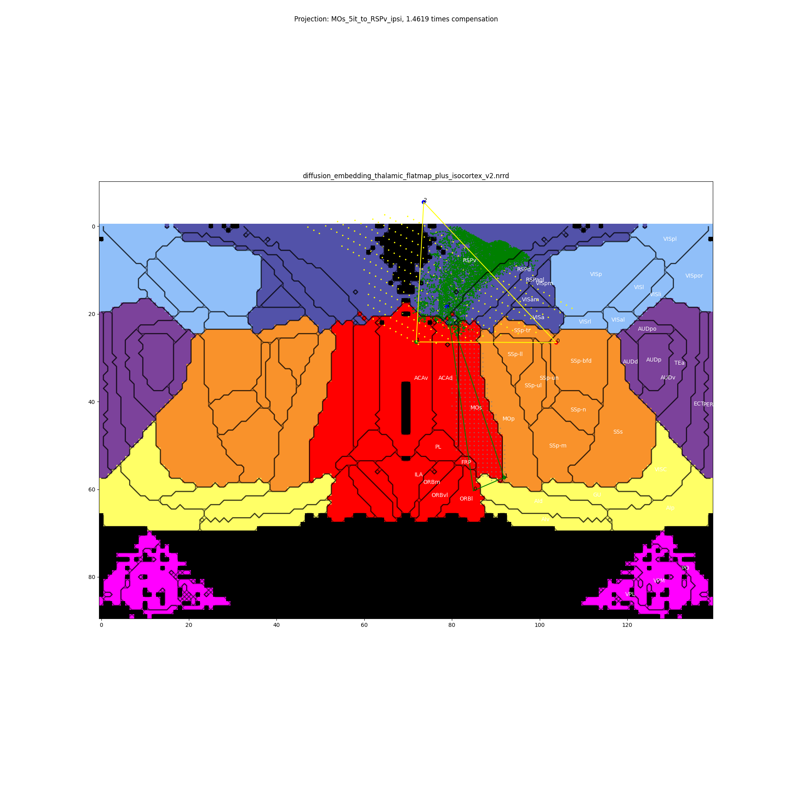
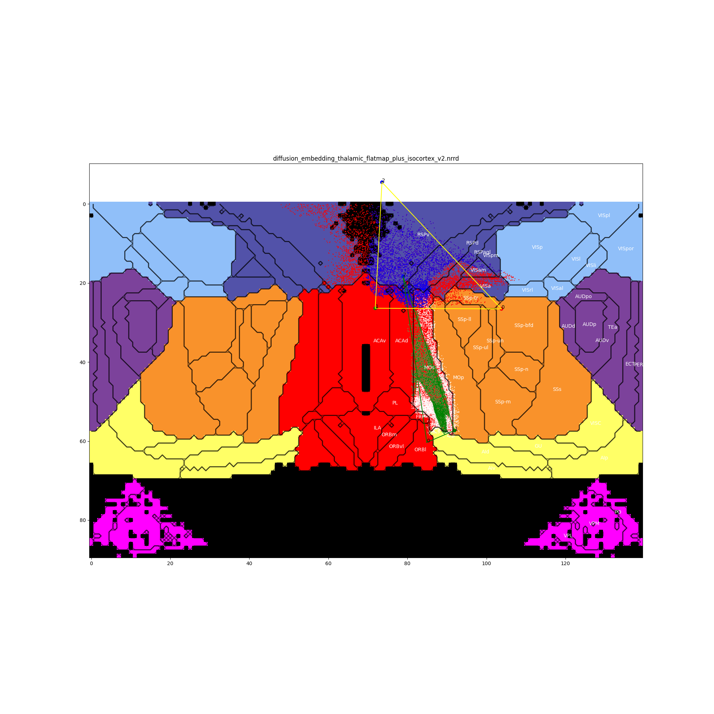
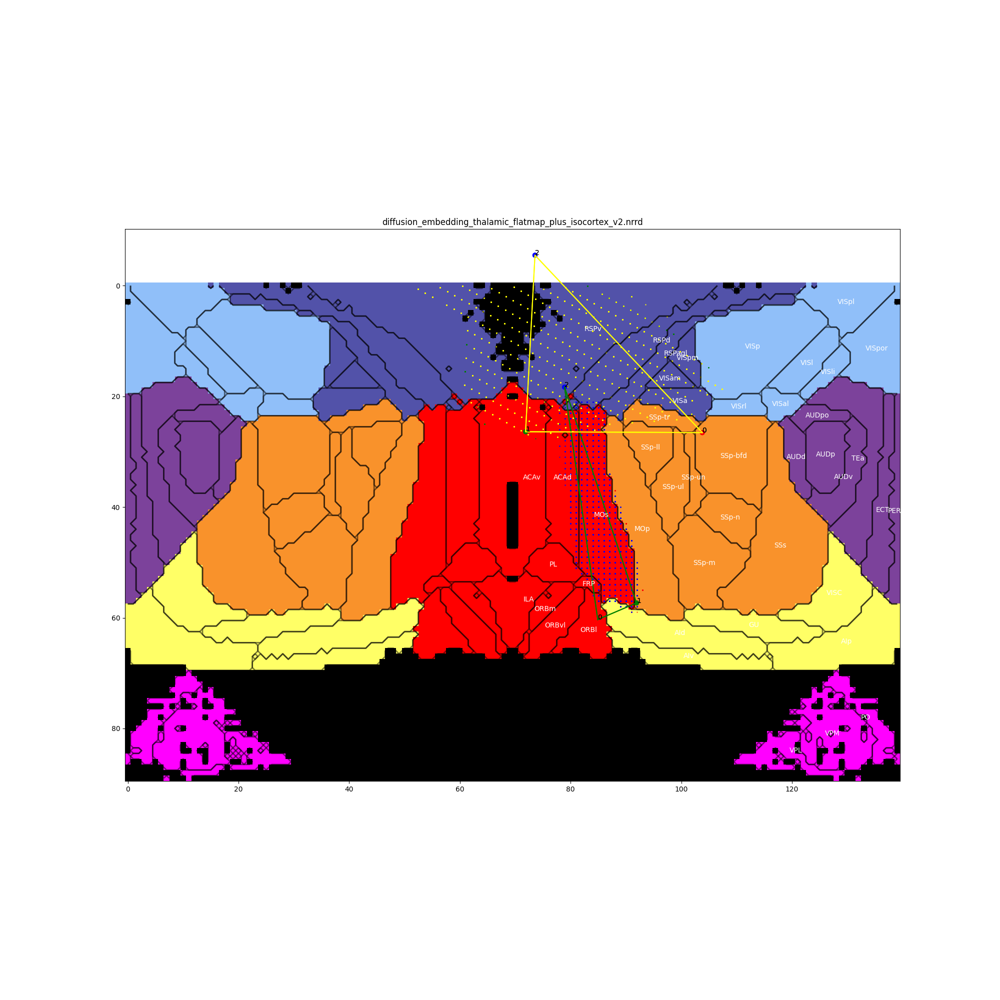

Tutorial
========

In all these examples, `$CONFIG` is the path to the yaml :ref:`Config` file and `$OUTPUT` is the path to the output directory.

.. note:

   A cache directory is specified in the config directory; when changing the
   recipe, or starting over, it's a good idea to clear this directory.

Allocation
~~~~~~~~~~

Allocate source cell GIDS by region, and store them for use when assigning target GIDS.

* This only needs to be run once.
* This creates `$OUTPUT/allocations.h5` file.

.. code-block:: bash

   white-matter -vv micro -c $CONFIG -o $OUTPUT allocate

Compensation
~~~~~~~~~~~~

Calculate :ref:`Density Compensation` for all projections

* This only needs to be run once.
* This creates `$OUTPUT/COMPENSATION` directory, and the `$OUTPUT/density_compensation_$side.csv` file.

Optional: only need if `compensation: true` is in the config

.. code-block:: bash

    white-matter -vv micro -c $CONFIG -o $OUTPUT calculate-compensation --side right

Sample All
~~~~~~~~~~

Create and save segment sample regions for *target* population.

* Classically, with the recipes at the `bbp`, this usually often named something like `MOs_ALL_LAYERS`.
* To create the white matter for a full circuit, all of the `*_ALL_LAYERS` need to be done, and for each `SIDE` (ie: left or right).
* This creates the `.feather` files under `$OUTPUT/SAMPLED`

.. code-block:: bash

    white-matter -vv micro -c $CONFIG -o $OUTPUT sample-all --population $POPULATION --side $SIDE

Subsample
~~~~~~~~~

Create candidate synapses from full set of segments created by :ref:`Sample All`

* Classically, with the recipes at the `bbp`, this usually often named something like `MOs_ALL_LAYERS`.
* To create the white matter for a full circuit, all of the `*_ALL_LAYERS` need to be done, and for each `SIDE` (ie: left or right).
* This creates the `.feather` files under `$OUTPUT/SAMPLED/$SIDE/`

.. code-block:: bash

    white-matter -vv micro -c $CONFIG -o $OUTPUT subsample --population $POPULATION --side $SIDE

Assignment
~~~~~~~~~~

Assign sgids created in `allocations` with candidate synapses from `subsample`.

* Classically, with the recipes at the `bbp`, this usually often named something like `MOs_ALL_LAYERS`.
* To create the white matter for a full circuit, all of the `*_ALL_LAYERS` need to be done, and for each `SIDE` (ie: left or right).
* This creates the `.feather` files under `$OUTPUT/ASSIGNED`

.. code-block:: bash

    white-matter -vv micro -c $CONFIG -o $OUTPUT assignment --population $POPULATION --side $SIDE

Write output
~~~~~~~~~~~~

.. code-block:: bash

    white-matter -vv micro -c $CONFIG -o $OUTPUT write-syn2 --population $POPULATION --side $SIDE

Analysis
~~~~~~~~

Optional: A number analysis, producing either figures or text output are available:

flat-map
........

Draw the flat-map and all the source triangles for the various regions.

Useful to check that the flat-map is loaded properly, and the coordinate systems are compatible.

.. code-block:: bash

    white-matter -vv analysis -c $CONFIG -o $OUTPUT flat-map

calculate-compensation
......................

Plot the locations of source and targets used for calculating the :ref:`Density Compensation`.

.. code-block:: bash

    white-matter -vv analysis -c $CONFIG -o $OUTPUT calculate-compensation --name $PROJECTION_NAME --side $SIDE

Legend:

* Green triangle: Source region
    * Grey points: source sampled positions in flat map

* Yellow triangle: Target region
    * Yellow points: source sampled in flat mapped to target region
    * Green points: source sampled in flat mapped to target region, within the cutoff range of target region mapped cells

source-locations
................

Post `assignment`, this is one of the most important validations.

It shows which source locations have been used on the flat-map compared to all the ones that exist.

In addition, it shows where these source locations are mapped to in the target flat-map.

.. code-block:: bash

    white-matter -vv analysis -c $CONFIG -o $OUTPUT source-locations --name $PROJECTION_NAME --side $SIDE

Legend:

* Green triangle: Source region
    * Grey: source cell positions in flat map
    * Green: used source cell positions in flat map

* Yellow triangle: Target region
    * Red: source cell positions in flat mapped to target region
    * Blue: used source cell positions in flat mapped to target region

allocation-stats
................

.. code-block:: bash

    white-matter -vv analysis -c $CONFIG -o $OUTPUT allocation-stats --population $POPULATION

An example::

    Population Fractions
                           expected  allocated  absolute_difference
    FRP_23_to_AId_contra       4797       4797                  0.0
    FRP_23_to_AId_ipsi         4377       4377                  0.0
    FRP_23_to_FRP_contra       6526       6526                  0.0
    FRP_23_to_MOs_contra       9289       9289                  0.0
    FRP_23_to_MOs_ipsi         9289       9289                  0.0
    FRP_23_to_ORBl_contra      3407       3407                  0.0
    FRP_23_to_ORBl_ipsi        3407       3407                  0.0
    FRP_23_to_ORBm_ipsi        2952       2952                  0.0
    FRP_23_to_ORBvl_ipsi       3023       3023                  0.0
    FRP_23_to_PL_ipsi          3440       3440                  0.0

    Population Interactions
                       Group0                 Group1  expected  actual  absolute_difference
    35  FRP_23_to_ORBl_contra    FRP_23_to_ORBl_ipsi      2291    1333             0.418158
    37  FRP_23_to_ORBl_contra   FRP_23_to_ORBvl_ipsi      2033    1247             0.386621
    40    FRP_23_to_ORBl_ipsi   FRP_23_to_ORBvl_ipsi      2149    1378             0.358772
    36  FRP_23_to_ORBl_contra    FRP_23_to_ORBm_ipsi      1698    1133             0.332744
    39    FRP_23_to_ORBl_ipsi    FRP_23_to_ORBm_ipsi      1698    1197             0.295053
    38  FRP_23_to_ORBl_contra      FRP_23_to_PL_ipsi      1979    1431             0.276908
    41    FRP_23_to_ORBl_ipsi      FRP_23_to_PL_ipsi      1979    1517             0.233451
    43    FRP_23_to_ORBm_ipsi      FRP_23_to_PL_ipsi      1938    1494             0.229102
    42    FRP_23_to_ORBm_ipsi   FRP_23_to_ORBvl_ipsi      1506    1164             0.227092
    44   FRP_23_to_ORBvl_ipsi      FRP_23_to_PL_ipsi      1756    1480             0.157175
    16     FRP_23_to_AId_ipsi      FRP_23_to_PL_ipsi      1227    1275             0.039120
    13     FRP_23_to_AId_ipsi    FRP_23_to_ORBl_ipsi      1215    1182             0.027160
    20   FRP_23_to_FRP_contra    FRP_23_to_ORBl_ipsi      1812    1854             0.023179
    29   FRP_23_to_MOs_contra      FRP_23_to_PL_ipsi      2605    2549             0.021497
    14     FRP_23_to_AId_ipsi    FRP_23_to_ORBm_ipsi      1053    1075             0.020893
    21   FRP_23_to_FRP_contra    FRP_23_to_ORBm_ipsi      1570    1601             0.019745
    12     FRP_23_to_AId_ipsi  FRP_23_to_ORBl_contra      1215    1192             0.018930
    33     FRP_23_to_MOs_ipsi   FRP_23_to_ORBvl_ipsi      2289    2326             0.016164
    34     FRP_23_to_MOs_ipsi      FRP_23_to_PL_ipsi      2605    2647             0.016123
    4    FRP_23_to_AId_contra  FRP_23_to_ORBl_contra      1332    1350             0.013514
    27   FRP_23_to_MOs_contra    FRP_23_to_ORBm_ipsi      2235    2207             0.012528
    26   FRP_23_to_MOs_contra    FRP_23_to_ORBl_ipsi      2580    2549             0.012016
    31     FRP_23_to_MOs_ipsi    FRP_23_to_ORBl_ipsi      2580    2607             0.010465
    15     FRP_23_to_AId_ipsi   FRP_23_to_ORBvl_ipsi      1078    1067             0.010204
    0    FRP_23_to_AId_contra     FRP_23_to_AId_ipsi      1711    1694             0.009936
    23   FRP_23_to_FRP_contra      FRP_23_to_PL_ipsi      1830    1847             0.009290
    22   FRP_23_to_FRP_contra   FRP_23_to_ORBvl_ipsi      1608    1622             0.008706
    7    FRP_23_to_AId_contra   FRP_23_to_ORBvl_ipsi      1182    1174             0.006768
    25   FRP_23_to_MOs_contra  FRP_23_to_ORBl_contra      2580    2563             0.006589
    8    FRP_23_to_AId_contra      FRP_23_to_PL_ipsi      1345    1353             0.005948
    5    FRP_23_to_AId_contra    FRP_23_to_ORBl_ipsi      1332    1326             0.004505
    6    FRP_23_to_AId_contra    FRP_23_to_ORBm_ipsi      1154    1149             0.004333
    32     FRP_23_to_MOs_ipsi    FRP_23_to_ORBm_ipsi      2235    2226             0.004027
    19   FRP_23_to_FRP_contra  FRP_23_to_ORBl_contra      1812    1819             0.003863
    11     FRP_23_to_AId_ipsi     FRP_23_to_MOs_ipsi      3314    3326             0.003621
    9      FRP_23_to_AId_ipsi   FRP_23_to_FRP_contra      2328    2336             0.003436
    24   FRP_23_to_MOs_contra     FRP_23_to_MOs_ipsi      7033    7011             0.003128
    1    FRP_23_to_AId_contra   FRP_23_to_FRP_contra      2552    2546             0.002351
    30     FRP_23_to_MOs_ipsi  FRP_23_to_ORBl_contra      2580    2574             0.002326
    28   FRP_23_to_MOs_contra   FRP_23_to_ORBvl_ipsi      2289    2284             0.002184
    3    FRP_23_to_AId_contra     FRP_23_to_MOs_ipsi      3632    3627             0.001377
    18   FRP_23_to_FRP_contra     FRP_23_to_MOs_ipsi      4941    4936             0.001012
    10     FRP_23_to_AId_ipsi   FRP_23_to_MOs_contra      3314    3311             0.000905
    17   FRP_23_to_FRP_contra   FRP_23_to_MOs_contra      4941    4938             0.000607
    2    FRP_23_to_AId_contra   FRP_23_to_MOs_contra      3632    3630             0.000551

triangle-map
............

For a particular projection, show the source and target triangles, and samples the source voxels and translates them to their target flat-map regions.

.. code-block:: bash

    white-matter -vv analysis -c $CONFIG -o $OUTPUT triangle-map --name $PROJECTION_NAME --side $SIDE

assignment-validation
.....................

.. code-block:: bash

    white-matter -vv analysis -c $CONFIG -o $OUTPUT assignment-validation --name $PROJECTION_NAME --side $SIDE

An example::

    Densities
        region subregion   density acronym  achieved_density  difference  percentage_difference  abs_percentage_difference
    12    RSPv         2  0.004304   RSPv2          0.002525   -0.001779              -0.413312                   0.413312
    64    RSPv         1  0.022264   RSPv1          0.013199   -0.009065              -0.407152                   0.407152
    116   RSPv        6a  0.032895  RSPv6a          0.015644   -0.017251              -0.524423                   0.524423
    168   RSPv        6b  0.032895  RSPv6b          0.030564   -0.002332              -0.070886                   0.070886
    220   RSPv         3  0.004304   RSPv3          0.003954   -0.000349              -0.081171                   0.081171
    272   RSPv         5  0.003812   RSPv5          0.002282   -0.001530              -0.401436                   0.401436

.. note:

   It's not uncommon for the numbers to be very different; this is an interaction between the triangles, and how they may the source region to the target one.
   The compensation attempts to correct for this, but it's not enough, it seems.
